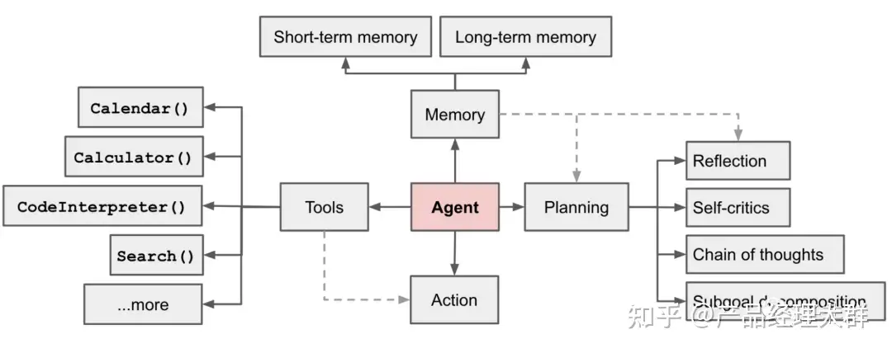
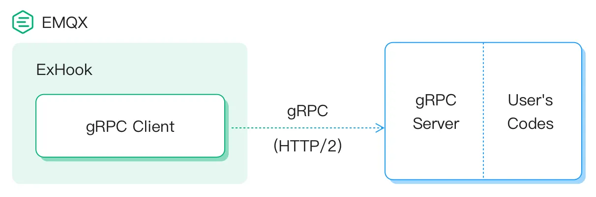
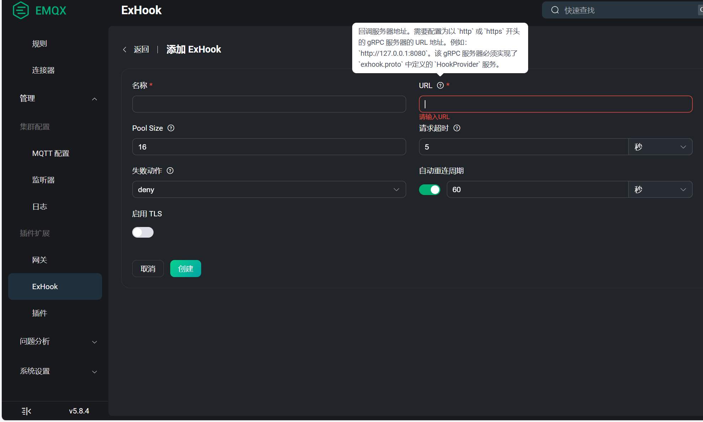
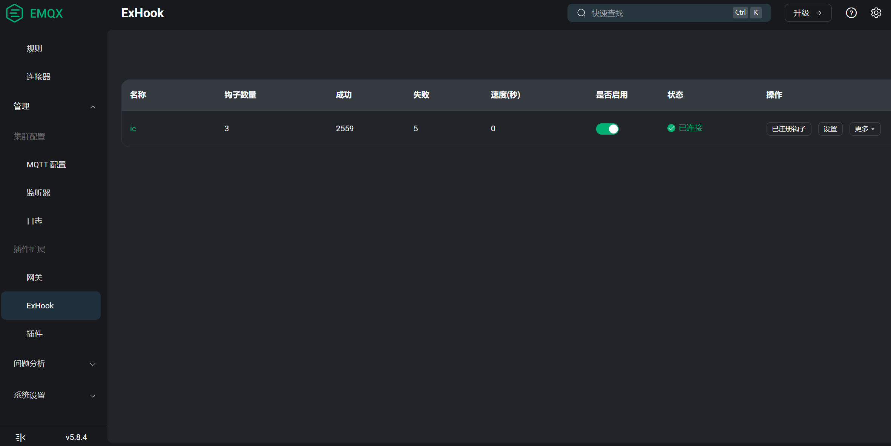
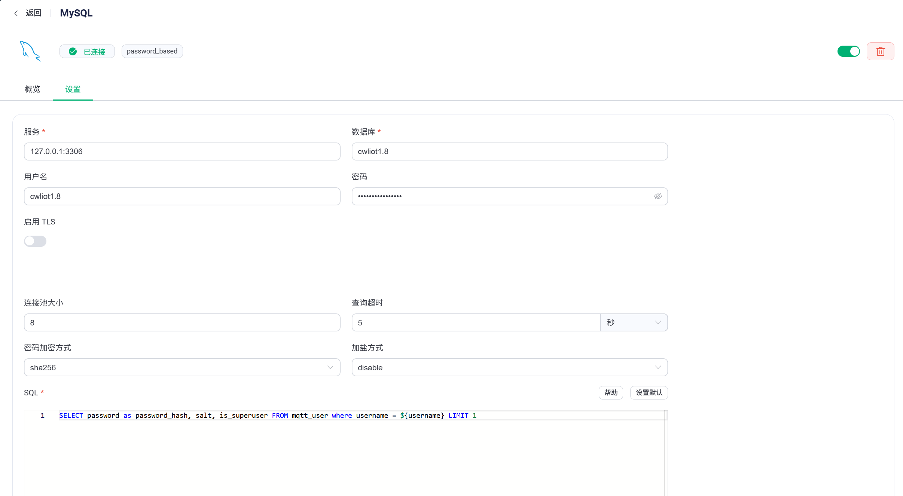

## 什么是物联网平台内核
> 物联网平台内核定义

物联网平台内核是一个轻量级的物联网平台，包含了物联网最核心的基础模块，
包括物模型、监控、AI、MQTT、微信小程序、微信服务号等模块。该平台旨在帮助开发者快速搭建物联网应用，提高开发效率。
物联网平台内核并不包括ui组件，只提供基础的api接口，开发者可以自由选择自己喜欢的ui框架来搭建应用。

## 什么是Agent智能体
Agent智能体可以自我学习。智能体是一种通用问题解决器。从软件工程的角度看来， 
智能体是一种基于大语言模型的，具备规划思考能力、记忆能力、使用工具函数的能力，能自主完成给定任务的计算机程序。
目前已经有很多的智能体框架，如langchain,promptulate和agently。但给智能体编写工具并不是一件非常容易的
事情，需要掌握良好的提示工程技术和抽象能力，因此本物联网内核提供了Agent智能体的抽象，并直接提供了可用的工具
集合，做到真正的开箱即用。


## 什么是物模型
物模型是物联网平台内核的基础模块，它定义了物联网设备的功能和属性，例如开关、亮度、温度、湿度等。
本物联网平台内核提供了物模型管理模块，用户可以轻松管理物联网设备的功能和属性。

## 安装部署流程

### 一、容器化环境初始化
1. 进入项目docker目录执行以下命令：
```bash
cd docker && docker-compose up -d
```
* 该操作将自动创建并启动以下服务容器：
    - MySQL 数据库服务
    - Redis 缓存服务
    - EMQX MQTT消息中间件(https://www.emqx.com/zh)
    - InfluxDB 时序数据库
    - Chroma 一个开源的向量数据库，用于存储和检索向量数据。(https://docs.trychroma.com/docs/overview/introduction)

2. 验证容器状态（可选）：
```bash
docker-compose ps
```

### 二、应用配置指引
1. 修改`application.yaml`配置文件，配置数据库连接：
```yaml
spring:
  influx:
    user: cwl
    # 你的数据库url
    url: http://[容器IP]:8086
    password: [数据库密码]
    mapper-location: top.rslly.iot.dao
    dataBaseName: data
    retention: autogen     #保存策略
  datasource:
    url: jdbc:mysql://[容器IP]:3306/[数据库名]?useSSL=false&characterEncoding=UTF-8
    username: [数据库用户名]
    password: [数据库密码]
  redis:
    host: [容器IP]
    port: 6379
    password: [redis密码]
```

2. 配置持久层参数（建议生产环境使用update模式）：
```yaml
jpa:
  hibernate:
    ddl-auto: update # 自动更新表结构，保留数据
  show-sql: false    # 生产环境建议关闭SQL日志
```

### 三、首次启动注意事项
1. 容器IP建议替换为实际Docker网络地址（可通过`docker network inspect bridge`查询）
2. 首次启动建议设置`ddl-auto: create`初始化数据库结构，后续改为update
3. 刚启动时候数据库没有用户数据，因而无法登录，请手动添加管理员用户数据进行初始化，role为admin,password格式为 `{bcrypt}XXXX`
   XXX为bcrypt加密后的密文，具体请看SpringSecurity的加密规则。
   
   > user表的结构
4. 各中间件默认端口如被占用，需同步调整docker-compose.yaml中的端口映射配置
5. 生产环境建议配置独立的数据库账号并设置访问白名单
6. 内网环境需要使用穿透技术，如frp软件。

### 四、配置exhook和EMQX安全扩展
> 多语言的 钩子扩展 由 emqx-exhook 插件进行支持。它允许用户使用其它编程（例如：Python、Java 等）直接向 EMQX 挂载钩子，
  以接收并处理 EMQX 系统的事件，达到扩展和定制 EMQX 的目的。

1. 登录emqx dashboard ，点击菜单：插件扩展 -> Exhook -> 添加
   
   > 特别注意：由于本机使用docker安装EMQX服务器，因此上面的地址不能填写locahost（127.0.0.1），
   具体ip请根据实际情况进行填写。
2. 开启exhook插件

3. 配置安全系统
> 安全是所有开发者需要重点去关注的内容，本平台需要配置安全系统，以保护用户的隐私和数据安全，本平台设备安全系统依赖EMQX安全机制，
> EMQX安全系统主要由五个部分组成:

* 1.网络与 TLS：端对端加密通信，包括如何启用 SSL/TLS 连接和获取 SSL/TLS 证书。
* 2.认证系统：身份认证是物联网应用的重要组成部分，可以帮助有效阻止非法客户端的连接。 
* 3.授权系统：用于管理用户的访问权限，确保用户只有合法的权限才能访问系统资源。 
* 4.黑名单：EMQX 为用户提供了黑名单功能，用户可以通过 Dashboard 和 HTTP API 将指定客户端加入黑名单以拒绝该客户端访问，除了客户端标识符以外，还支持直接封禁用户名甚至 IP 地址。
* 5.连接抖动检测：EMQX 支持自动封禁那些被检测到短时间内频繁登录的客户端，并且在一段时间内拒绝这些客户端的登录，以避免此类客户端过多占用服务器资源而影响其他客户端的正常使用。

本平台提供了默认的认证和授权系统，需要在EMQX面板进行配置方可启动安全系统保障设备安全。
* 1.配置认证系统，选择认证方式为使用 MySQL 进行客户端认证。

* 2.配置授权系统，选择授权方式为使用 MySQL 进行客户端授权。

### 五、微信小程序和微信服务号接入
1. 在application.yaml中配置微信小程序和微信服务号的appid和appsecret，以及微信的ToUserName，ToUserName是小程序的微信号。
   可以通过截获微信服务器的请求获取。
```yaml
wx:
  debug: true  (生产模式下请设置为false，否则无法获取access_token)
  appid: XXXXXX (服务号appid)
  appsecret: XXXXXX (服务号appsecret)
  templateUrl: XXXXX (模板消息跳转的链接)
  alarmTemplateId: XXXXXX (模板消息的模板id)
  micro: (小程序)
    appid: XXXXXX
    appsecret: XXXXXX
    ToUserName: XXXXXX
    appid2: XXXXXX
    ToUserName2: XXXXXX
    appsecret2: XXXXXX
  msg:
    token: XXXXXX
```
2. 将项目的api添加到微信开放平台，并配置好回调地址，然后就可以通过微信小程序或者微信服务号进行愉快的玩耍了。
   详情请参考微信开放平台文档。(https://developers.weixin.qq.com/doc/offiaccount/Basic_Information/Access_Overview.html)
3. 如果需要使用消息推送功能的用户，请配置好模板消息模板，具体请参考微信开放平台文档。
### 六、邮件配置
> 邮件系统配置对于物联网平台至关重要，它可以提供注册验证，以及后续上线的邮件通知功能和密码找回功能等。
  请按照以下模板进行配置。
```yaml
mail:
    host: smtp.126.com
    port: 465
    protocol: smtps
    username: ruanzhen1234@126.com[你的邮件地址]
    password: XXX
    default-encoding: UTF-8
    properties:
      mail:
        smtp:
          ssl: true
  thymeleaf:
    cache: true
    mode: html
    prefix: classpath:/templates/
    encoding: UTF-8
    servlet:
      content-type: text/html
```
smtp邮件服务器配置，需要到邮箱服务商申请，并配置好相关参数，相关配置请参考对应的邮件服务商文档。
### 七、知识库配置
>物联网平台内置知识库功能，可以根据用户上传的知识进行知识库检索，并将结果输入到智能体中以使得智能体更加智能。
但使用该功能需要嵌入模型和向量数据库的支持，因此需要配置模型和向量数据库。以下是配置模板。

* 1.平台当前支持的嵌入模型有：
  * 1.bge-small-zh-v1.5-quantized
  * 2.silicon-qwen-Embedding-0.6B
* 2.目前支持的向量数据库有：
  * 1.Chroma数据库

```yaml
rag:
    embedding_modelName: bge-small-zh-v1.5-quantized
    knowledge_chat_embeddingStore_url: http://localhost:8000[你的向量数据库地址]
```
### 八、联网搜索selenium安装（最新版本已废弃）
>如果你不需要使用AI联网搜索，那么至此处恭喜你，你已经拥有一个属于自己的物联网平台了，祝你愉快。
但如果需要使用AI联网搜索，那么你需要安装selenium，selenium是一个开源的浏览器自动化测试工具，
它可以自动模拟浏览器行为，如点击、输入、提交表单等，从而实现自动化测试和模拟用户操作。

1. 安装服务器无头谷歌浏览器。
```bash
wget https://dl.google.com/linux/direct/google-chrome-stable_current_amd64.deb
sudo dpkg -i google-chrome*.deb
sudo apt-get install -f
```
查看当前浏览器版本
```bash
google-chrome --version
```
2. 配置运行的chrome驱动
先下载对应版本的chromedriver(http://npm.taobao.org/mirrors/chromedriver/)
解压到自己方便寻找的目录
```bash
unzip chromedriver_linux64.zip
```
3.配置application.yaml文件
```yaml
ai:
  chromeDrive-path: [chromedriver路径]
  chrome-path: [chrome可执行文件路径]
  audio-tmp-path: [临时音频文件存放路径]
  audio-temp-url: [项目运行的域名]
  glm-key: 
  deepSeek-key: 
  dashscope-key: 
  robot-name: [机器人名称]
  team-name: 创万联
```
通过以上步骤即可完成基础环境的搭建与配置，建议通过健康检查接口验证各服务连接状态。如果你需要
控制家里的电气，你可以选择安装homeAssistant与本平台集成，它将帮助你管理家庭的电器，并提供流畅的体验。

## 如何使用该平台内核
安装部署后，启动后访问呢http://localhost:8080/swagger-ui/index.html
即可获得完整的接口文档，使用这些接口既可以快速开发物联网应用，也可以作为基础模块来搭建物联网应用。
本文档也会详细介绍如何使用该平台内核，并介绍该内核的设计思想，以下是一般接入物联网平台内核的步骤：
* 1.[创建物模型和设备接入](get_started/create_thingsmodel.md)


## 接入微信服务号使用效果

<video  controls="controls" width="500" height="200">
<source src="../video/demo.mp4" type="video/mp4">
</video>

## Agent语音交互效果(接入Esp32)

<video  controls="controls" width="500" height="200">
<source src="../video/demo2.mp4" type="video/mp4">
</video>